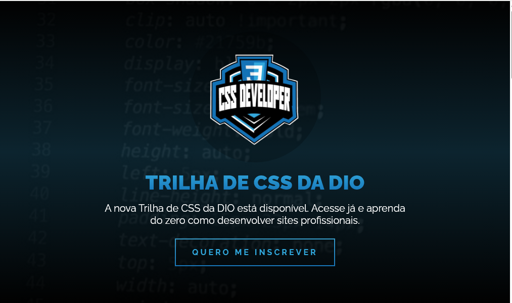

# 🌐 Trilha de CSS da DIO

Projeto desenvolvido durante o curso **Trilha de CSS** da [Digital Innovation One (DIO)](https://dio.me). O objetivo foi aplicar os principais conceitos de HTML e CSS para construir uma página visualmente agradável, moderna e responsiva.

---

## 📸 Prévia

---

## 🧰 Tecnologias Utilizadas

- HTML5
- CSS3
- Google Fonts (Raleway)
- Imagens de uso livre (Pexels)

---

## 🖼 Estrutura de Pastas

/projeto
├── index.html
├── css/
│ ├── ri.css
│ └── reset.css
├── imagens/
│ ├── logo.png
│ ├── banner.png
│ ├── woman-code.png
│ ├── professional-challenges.png
│ └── dio-logo.png

---

## 📄 Descrição das Seções

### ✅ Header
- Contém um **banner com gradiente e imagem de fundo**
- Apresenta o **logo**, um **título principal**, descrição e **botão de inscrição**

### 📚 Course Content
- Explica o conteúdo do curso dividido em 3 módulos com **estilização em blocos personalizados**

### 🌍 Transform World
- Seção com **imagem de fundo fixa** e texto em destaque incentivando a transformação através da tecnologia

### 💼 Professional Challenges
- Apresenta oportunidades profissionais, com **imagem e parágrafo motivacional**

### 🔚 Footer
- Mostra o logo da DIO e um link para o site oficial

---

## 💡 Destaques Técnicos

- Uso de **gradientes lineares** e **efeitos de recorte de texto com background**
- Aplicação de **efeito parallax** com `background-attachment: fixed`
- Estilização de botões com `border-image`
- Uso de `text-transform`, `box-shadow`, `border-radius`, e `object-fit`

---

## 🔗 Acesso

Você pode rodar o projeto localmente abrindo o arquivo `index.html` em qualquer navegador moderno.

---

## 📝 Licença

Este projeto foi desenvolvido para fins educacionais e segue os termos da plataforma [DIO](https://dio.me). As imagens utilizadas são de uso livre.

